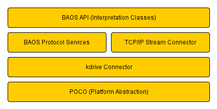

= BAOS SDK User Guide
:author: Weinzierl Engineering GmbH
:email: <info@weinzierl.de>

== Getting Started
[[chap-User_Guide-GettingStarted]]

This document briefly describes the kdrive BAOS SDK. The kdrive BAOS client library is a {cpp}
implementation of the KnxBAOS Protocol Versions 1.2 and 2.0. A managed C++ .NET wrapper is also
implemented to enable application development with C# or Visual Basic .NET. The class library
aligns itself with the KnxBAOS protocol, and for each protocol message type a corresponding
class is available to send/receive the message data. In addition several convenience classes are
provided to interpret the information, such as a Datapoint class for converting the raw byte
stream into a specific parameter type. The system block diagram is shown below:
    
[[img-kdrivebaosarch]]
.kdrive BAOS System Block Diagram

=== Compiling and Installing
[[chap-User_Guide-GettingStarted-Compiling_Installing]]

The SDK uses the CMake build system. See the BuildingTheSDK document. The following
configuration options are available as part of the CMake build system:

[options="header"]
.Options
|===
|Option |Description
|WZSDK_BINDINGS |If selected builds the .NET wrapper. For MSVC builds only.
|WZSDK_SAMPLES |Includes the C++ samples.
|WZSDK_SAMPLES_QT |Includes the C++ Qt samples. Requires Qt.
|WZSDK_STATIC |Determines whether the build the library statically or dynamically. (where dynamic is .dll or .so etc depending on the platform).
|===

If you plan on writing your own build system there are a number of compile time defines
(flags) that may need to be set. Please contact us for more information.
    
=== Using the SDK
[[chap-chap-User_Guide-GettingStarted-Using]]

Once you have compiled the SDK consult the included samples and API reference in the documentation directory. 
There is also a skeleton tutorial below for setting a Datapoint and receiving a Datapoint Indication.

=== Tutorial
[[chap-User_Guide-GettingStarted-Tutorial]]

==== Set a Datapoint Value
[[chap-User_Guide-GettingStarted-dp-value]]

[source, c++]
.Set a Datapoint Value
----
include::extras/set_datapoint_value.cpp[]
----

First we create a ScopedStreamConnection. This class is responsible for creating a TCP/IP Stream
Connector which automatically connects to the BAOS device. When the ScopedStreamConnection goes
out of scope it automatically closes the connection (i.e. RAII). The second line gets the
abstract Connector from the ScopedStreamConnection. This connector is used in the library to
abstract away physical communication details. We create a BaosDatapoint class and provide it
with the connector and the datapoint id, in this case 1 indicating the first id. Finally we set
the boolean value. Note: there are a number of formatting functions available to set datapoint
values.

==== Set a Datapoint Events
[[chap-User_Guide-GettingStarted-dp-events]]

[source, c++]
.Datapoint Events
----
include::extras/datapoint_events.cpp[]
----

The BaosEvent class can be used to receive event notifications. It connects to the rx packet
signals from the BaosConnector and filters the received packets to forward the datapoint value
indications and the datapoint get value responses to a single handler. This has the advantage
that you can handle the asynchronous events from the bus as well as the responses to a read
request (for example at application startup) with the same code handler.

=== Implementation Aspects
[[chap-User_Guide-GettingStarted-Implementation_Aspects]]

The following points may be of interest:

Thread safety::
    The classes are not always thread safe and should not be used without synchronization
    across multiple threads without first checking the implementation (i.e. whether a mutex
    is used). The RPC mechanism uses the ScopedWait class with the connector and ensures that
    connector is blocked when running a service. This means you can use a single connector
    across multiple threads without having to provide explicit synchronization for the
    communication.

Callback Indications::
    The connector internally sets up a notification thread for packet notifications.
    When you use the callback notification listener (including the BaosEvent) you will be
    in the context of the notification thread. In short, if you are updating a User
    Interface you should forward the notification to the main GUI thread. In Qt you can do
    this using a signal, in MFC using PostMessage etc. Alternatively, if you are using
    shared data you will need to use standard thread synchronization patterns, which are
    available as part of Poco.
    
Exceptions::
    When an error response is returned from the baos device a ServerException is thrown.
    In any other error case a ClientException will be raised. Both ServerException and
    ClientException are derived from Po-co::Exception. In the scoped classes exceptions may
    be thrown from within the Constructor.
          
Application Structure::
    Generally you should only need to create a single Connector. 
    If you need to manage multiple BAOS devices you will need a Connector per device.
    
Boost::
    We use boost::signals2 and some other helpers, any version since Boost 1.41.0
    should be ok. You can download a cut-down version of the boost headers from our website.

BAOS Protocol Versions::
    The software provides support for protocol versions 1.2 (BAOS 770) and 2.0 (BAOS 771/772).
    The protocol can be auto-detected using the enumeration function, which includes the
    version information.

[apendix]
== Acknowledgements

Portions of the kdrive Libraries utilize the following copyrighted material, the use of which is
hereby gratefully acknowledged.

- Poco {cpp} http://pocoproject.org/index.html
- Boost {cpp} http://www.boost.org

